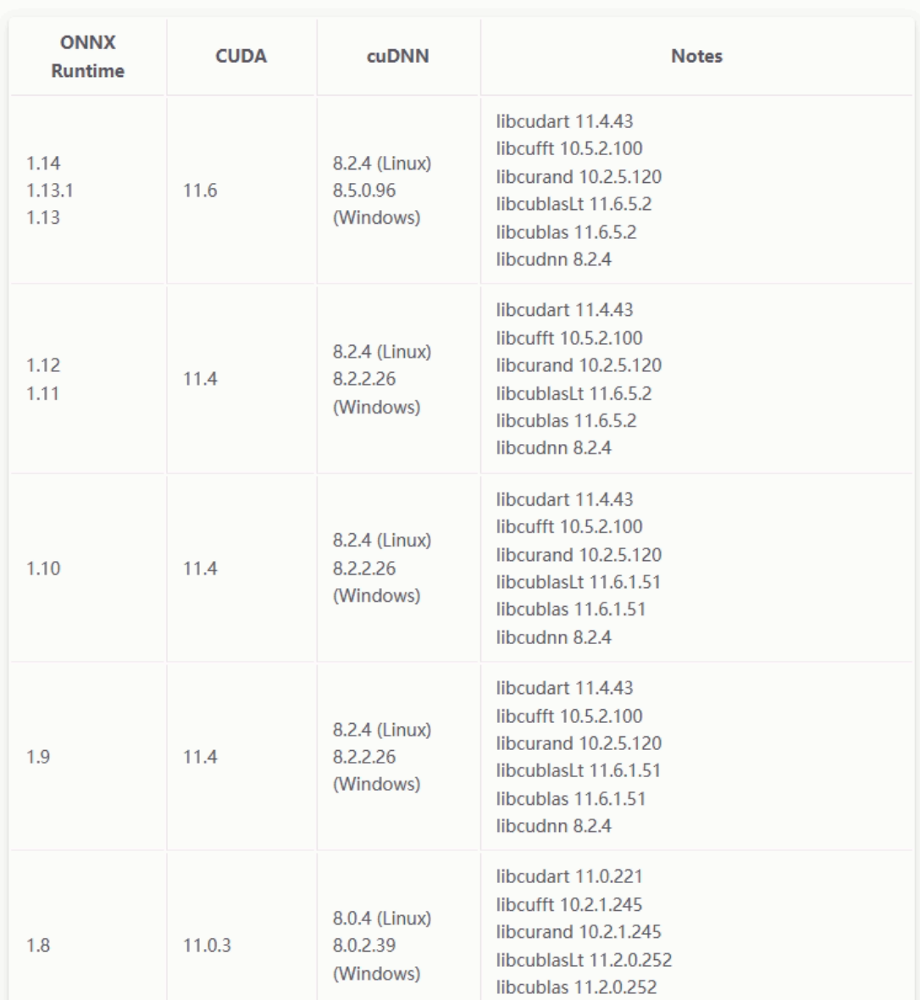

# ONNXRuntime部署（GPU版本）配置注意点

> [参考的配置github仓库](https://github.com/itsnine/yolov5-onnxruntime)
> 
> [参考教程](https://blog.csdn.net/m0_63774211/article/details/129794845)

1. **Dependecies**（依赖）
	* OpenCV 4.x
	* ONNXRuntime 1.7+（Github下载压缩包）
	* OS: Tested on Windows 10 and Ubuntu 20.04
	* CUDA 11+ [Optional]
2. CUDA、cuDNN与ONNX版本需匹配。[版本匹配查询](https://onnxruntime.ai/docs/execution-providers/CUDA-ExecutionProvider.html#requirements)
<p align="center">
  <a href="version.png"></a>
</p>

> 本项目使用的ONNXRuntime版本为1.12，对应的CUDA版本为11.4,cuDNN版本为8.2.2.26。ONNXRuntime版本过高或过低都会导致不兼容（不存在某某函数）。

1. 需要用**64位**编译器编译。
2. 需要在**Release模式**下运行。
3. 需要将64位的zlibwapi.dll文件放到CUDA的bin目录下。
4. 需要将onnxruntime.dll、onnxruntime_providers_cuda.dll、onnxruntime_providers_shared.dll和onnxruntime_providers_tensorrt.dll放到生成的.exe文件同级目录下。
5. cmake命令

```cmake
# old version
cmake .. -DONNXRUNTIME_DIR="D:/TrackingSystem/Codes/yolov5-onnxruntime/onnxruntime" -DCMAKE_BUILD_TYPE=Release
cmake --build . --config release -j8 # only running in Release mode

./Release/yolo_ort.exe -m ../cardetect.onnx -i ../images/car4.png -c ../carclass.txt --gpu 1
```

```cmake
# new version
mkdir build
cd build
cmake ..
cmake --build . --config release -j8
./Release/yolo_ort.exe -m ../models/cardetect.onnx -c ../models/carclass.txt --gpu 1
```